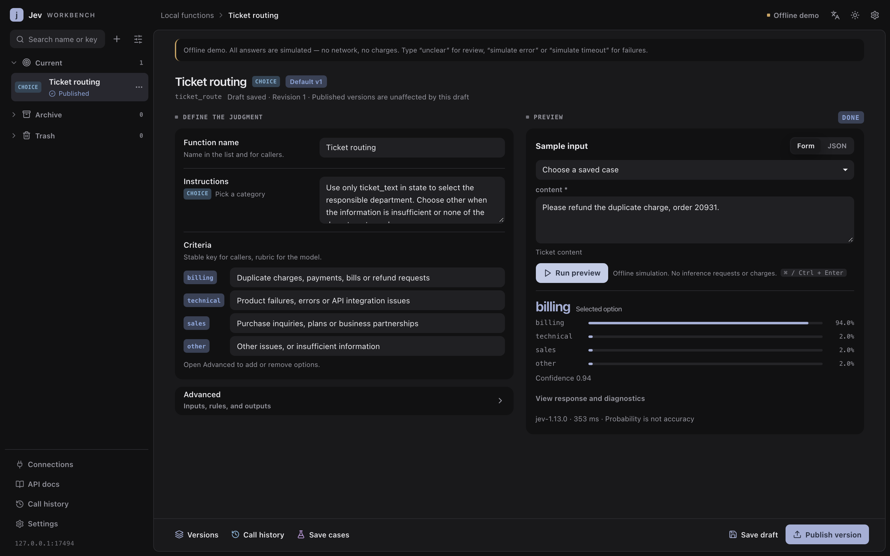
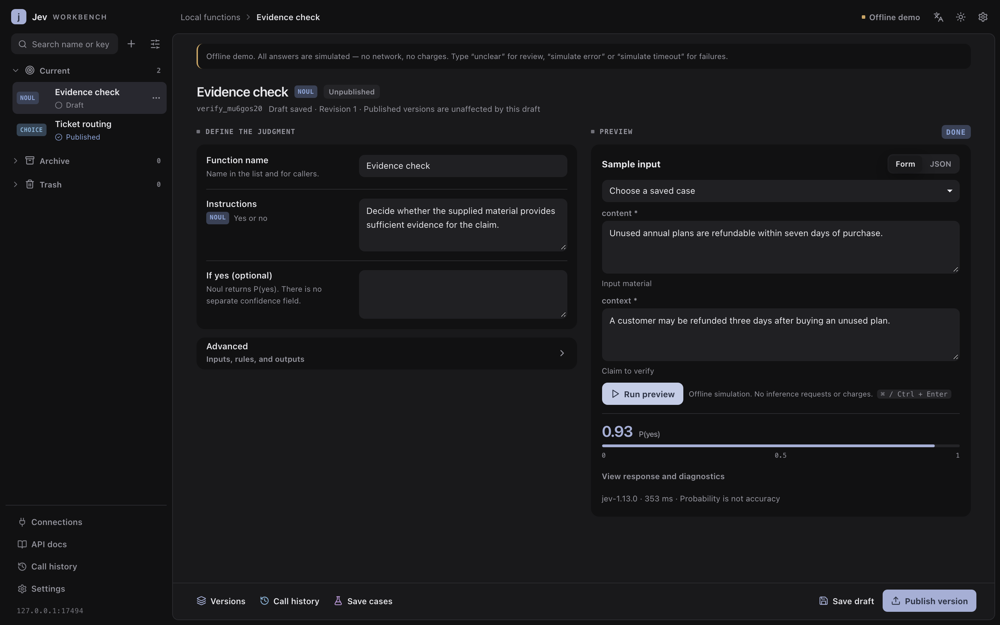
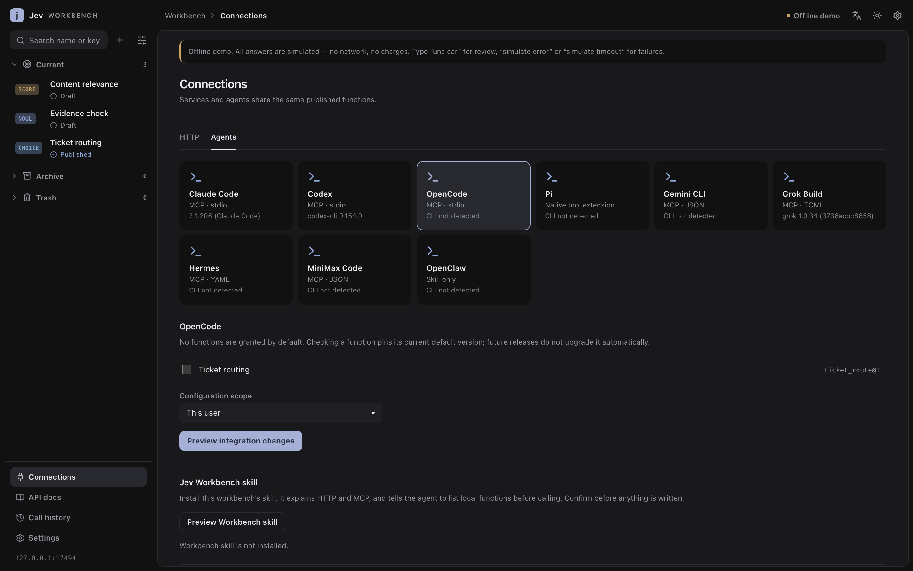
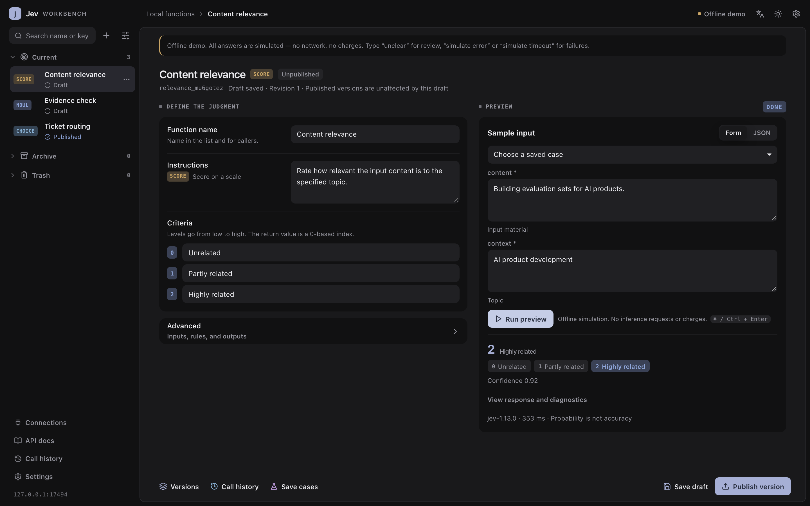

# Jev Workbench

中文 · [English](README.md)

**判断写一次，到处可调。**

Jev Workbench 是本机服务，用来在 TypeSafe 的 Jev 之上构建*判断函数*——像「这条工单是不是账单问题」「这些材料能不能支持这个结论」这样小而有版本的决策。你在浏览器里定义一个，用真实输入试跑，然后发布。之后**同一个已发布版本**同时回答你的后端（HTTP）和你的编码 Agent（MCP）。

TypeSafe 供应商 Key 不离开本机。调用方拿到的是受限客户端 Token，只能调用你授权并固定了版本的函数。



## 一分钟试用，不需要 Key

环境 Node.js 24、pnpm 11.9.0，在仓库根目录：

```sh
pnpm install --frozen-lockfile
pnpm build
pnpm demo
```

浏览器打开 [127.0.0.1:17430](http://127.0.0.1:17430)，已预置 `ticket_route@1`、四个样例和一个受限演示客户端。所有答案都是模拟的——不联网、不计费——每屏都有横幅说明。

在样例输入里填下面任意一条，点**试跑**：

| 输入 | 结果 |
|---|---|
| `Please refund the duplicate charge.` | `ok`，`department=billing` |
| `unclear, needs review` | `needs_review`，`department=null` |
| `simulate error` | 502 `UPSTREAM_UNAVAILABLE` |
| `simulate timeout` | 504 `UPSTREAM_TIMEOUT` |

也可以从命令行跑：

```sh
pnpm demo:call                          # 正常路径
pnpm demo:call 'unclear, needs review'
pnpm demo status                        # 在跑吗？
pnpm demo open                          # 重开管理会话
pnpm demo stop
```

演示数据独立放在 `~/.jev-workbench-demo`，不碰正式数据；`JEV_DEMO_HOME`、`JEV_DEMO_PORT` 可以换目录和端口。初始化只在空库跑一次，不覆盖你的修改。如果本机还有旧的中文演示库，删掉该目录再 `pnpm demo`。

## 整体结构

```
  浏览器（管理会话，127.0.0.1）
        │  定义 → 试跑 → 发布
        ▼
  ┌──────────────────────────────┐
  │  Jev Workbench               │──── TypeSafe Key ───▶  api.typesafe.ai
  │  草稿 · 版本 · 授权           │
  └──────────────────────────────┘
        ▲                      ▲
        │ 客户端 Token          │ 凭证文件
     你的后端                编码 Agent
   POST /v1/…/invoke        jev_invoke（MCP）
```

一个**函数**有一份可编辑草稿和任意多个**已发布版本**。发布会固定整份配置和模型版本，并且必须先有这份配置的成功试跑记录。已发布版本不可变——继续改草稿不会影响调用方拿到的结果。

**授权**把客户端 Token 绑到某个函数的固定版本上。发布 v2 不会自动升级任何人，等你准备好了再重新授权。

## Noul、Choice、Score

三种原语，各有自己的结果展示：

| 原语 | 问题 | 返回 |
|---|---|---|
| **Noul** | 这个成立吗？ | 成立的概率（没有独立的 confidence 字段） |
| **Choice** | 属于哪一类？ | 选中的 key，外加每个选项的概率 |
| **Score** | 在有序档位上是几档？ | 从 0 开始的档位索引，按概率加权 |

配置页左边是写给模型看的，右边是调用方拿到的。改写模型说明时，选项 key 对调用方保持稳定。



## 从后端调用

```sh
curl http://127.0.0.1:17420/v1/functions/ticket_route/invoke \
  -H "Authorization: Bearer $JEV_CLIENT_TOKEN" \
  -H 'Content-Type: application/json' \
  -d '{"version":1,"input":{"content":"我的订单被重复扣款，请协助退款。"}}'
```

| 接口 | 作用 |
|---|---|
| `GET /v1/functions` | 当前凭证能看到哪些函数 |
| `GET /v1/functions/:key` | 输入输出合同（内部问题不暴露） |
| `POST /v1/functions/:key/invoke` | 调用已发布版本 |
| `POST /v1/systemone` | 官方 TypeSafe 请求体，需要勾选「允许官方 Jev 调用」 |
| `GET /v1/models` | 官方模型列表，同一授权 |
| `GET /health/live` | 存活检查，不含密钥 |

错误形状是 `{"error":{"code","message"},"meta":…}`。`needs_review` **不是**错误：它是 200，是你自己的复核规则产生的业务状态。

调用方不能改上游地址，也不能提交 TypeSafe Key。演示服务拒绝官方那两条路由。

### 用官方 Python SDK

把 base URL 指到本机，[typesafe-sdk](https://github.com/typesafe-ai/typesafe-sdk-python) 就能直接调这个工作台。客户端 Token 需要有官方 Jev 授权；供应商 Key 依然不出本机。

```sh
pip install typesafe-sdk
export TYPESAFE_BASE_URL=http://127.0.0.1:17420
export TYPESAFE_API_KEY=$JEV_CLIENT_TOKEN
```

## 从编码 Agent 调用

**调用与接入 → Agent 接入**是一站式安装页：先检测本机有什么，再展示将要写入的确切内容，确认之前不动任何文件。



三件互相独立、可分别安装的东西：

1. **MCP 桥** —— 注册 `jev_list_functions`、`jev_describe_function`、`jev_invoke` 三个本地工具。
2. **Jev Workbench skill**（[`skills/jev-workbench`](skills/jev-workbench/SKILL.md)）—— 要求 Agent 先列出本机函数，再决定怎么调，而不是自己编一个调用。
3. **TypeSafe skill**（可选）—— 官方 [`typesafe-ai/skills`](https://github.com/typesafe-ai/skills)，用来指导设计 Jev 问题。调用本工作台不需要它。

| 运行端 | 桥 | 写入的配置 |
|---|---|---|
| Claude Code | MCP stdio | `~/.claude.json`（用户）或 `.mcp.json`（项目） |
| Codex | MCP stdio | `codex mcp add` → `~/.codex/config.toml` |
| OpenCode | MCP stdio | `opencode.jsonc`，保留注释 |
| Pi | 原生扩展 | 指向 `dist/pi-extension` 的加载文件 |
| Gemini CLI | MCP | `.gemini/settings.json` |
| Grok Build | MCP | `config.toml` |
| Hermes | MCP | `config.yaml` |
| MiniMax Code | MCP | `mcp.json` |
| OpenClaw | — | 仅 Skill |

每次接入都会生成**独立的凭证文件**（权限 0600）；Agent 配置里只有文件路径，不含 Token。撤销只删 `jev-workbench` 这一条，其他 MCP 服务和 skill 原样保留；如果这一条被人手工改过，计划会停下来而不是覆盖。

连接测试区分 `bridge_verified` 和 `http_verified`，两者都不代表目标 Agent 已经重载配置或真的调了模型。

MCP 桥也可以手动挂：

```sh
node /absolute/project/dist/mcp/index.js \
  --credentials-file /absolute/home/.jev-workbench/clients/example.json
```

Pi 扩展包独立在 `dist/pi-extension`（自带 package.json 与 typebox 依赖声明）：

```sh
JEV_CREDENTIALS_FILE=/absolute/path/client.json pi -e /absolute/project/dist/pi-extension/index.js
```

## 工作台本身



- 函数按**当前**、**归档**、**回收站**分组，可搜索，可按状态或原语筛选。
- 归档和回收站都保留全部版本、样例和授权，同时停止业务调用；恢复后回到原来的启停状态。
- 永久删除只在回收站里提供，需要明确确认，正在执行时会拒绝，删除时在一个事务里清掉该函数的版本、样例、授权和运行记录。
- 切换函数会保留本次会话里未保存的草稿、原始 JSON 编辑和试跑输入。业务正文不写 `localStorage`；有未保存内容时关闭标签页会先提醒。
- 默认英文，顶栏可切中文；默认深色，旁边的太阳图标切浅色。两种模式下你写的名称和说明都保持原文。

## 正式运行

```sh
pnpm start                  # 前台，Ctrl-C 停止
# 或
pnpm jev service start      # 后台，自动开浏览器
pnpm jev service status
pnpm jev service open       # 重开短期管理会话
pnpm jev service stop
```

绑定 `127.0.0.1:17420`，数据目录 `~/.jev-workbench`；`JEV_PORT` 和 `JEV_HOME` 可以同时换掉这两项，换完记得同步客户端配置。服务只绑 127.0.0.1，不支持远端机器直接访问。正式启动不安装依赖，供应商失败时**绝不**退回模拟数据。

在**设置**里配置 TypeSafe Key，或者由启动环境提供 `TYPESAFE_API_KEY`——环境变量优先，此时页面上的输入框变只读。页面里填的 Key 用 AES-GCM 加密保存，主密钥和密文都只有当前系统用户可读。没有 Key 也能编辑一切，只是推理返回 `PROVIDER_NOT_CONFIGURED`。演示里的试跑不能当作正式发布的证明。

正式路径：新建函数 → 编辑 → 填样例 → 试跑成功 → 发布固定模型版本 → 在调用与接入页创建固定版本授权 → 复制代码调用。

## 凭证与存了什么

三种凭证，刻意分开：

- **TypeSafe Key** —— 你的，留在本机，只用于上游调用。
- **管理会话** —— 短期，从终端引导建立，带 CSRF 校验。
- **客户端 Token** —— 每个调用方一个，创建时明文只显示一次，库里只存哈希，绑定固定版本，可撤销。

运行记录只存元数据：状态、耗时、模型、错误码。输入正文和答案不落库，所以无法回放。唯一例外是你明确保存的**测试样例**——它确实会把输入写进本机数据库。导出不含供应商 Key、客户端 Token 或调用正文。

## 备份、恢复与升级

**设置 → 备份与导出**调用 SQLite 在线备份接口（文件 0600），也可以把函数配置导出成 JSON。

升级顺序：停服务 → 备份 → `pnpm install --frozen-lockfile` → `pnpm build` → 启动。迁移记录在 `schema_migrations`。

恢复时先停服务，把现有 data 目录整体移到安全位置，再把备份复制成新目录里的 `workbench.db`，保持目录 0700、文件 0600。不要把备份直接盖在还带着旧 WAL 的运行中数据库上。

异常退出后，`pnpm jev service recover`（演示是 `pnpm demo recover`）会清理锁——但只在健康检查失败**且**记录的 PID 已经不存在时才清。重启会把遗留的 running 标记成 interrupted，不重放推理。停止服务时先关接入，3 秒宽限后取消剩余请求。

## 开发与验证

```sh
pnpm typecheck
pnpm test
pnpm build
pnpm exec playwright install chromium
pnpm test:e2e
```

Vitest 用临时 SQLite 和显式注入的上游 fixture；Playwright 用 17425 上的临时服务并显示测试模式；生命周期测试用 17426，MCP 测试用 17423，演示 17430 和正式 17420 都不受影响。全程不需要 Key。

| 路径 | 内容 |
|---|---|
| `packages/contracts` | 共享的函数 DSL |
| `apps/server/src` | 持久化、权限、执行、Provider、接入 |
| `apps/web/src` | React 工作台 |
| `apps/mcp`、`apps/pi-extension` | 只转发到 HTTP 的薄桥 |

界面遵循 [`specs/dropagent-visual/spec.md`](specs/dropagent-visual/spec.md)，其他合同见 [`specs/v1`](specs/v1/spec.md)、[`specs/official-proxy`](specs/official-proxy/spec.md)、[`specs/runtime-skills`](specs/runtime-skills/spec.md)，另有 [VALIDATION.md](VALIDATION.md) 和 [CONTRIBUTING.md](CONTRIBUTING.md)。

## 当前状态与边界

2026-09-18 已用真实 TypeSafe Key 跑通：模型列表、函数试跑、发布、客户端调用，以及官方 `POST /v1/systemone`。Agent 接入是对隔离配置文件和真实 CLI 版本验证的——**九个运行端内部的真实模型调用尚未验证**；往编辑器里装 skill 是产品动作，不会是测试的副作用。

没有持久化队列、缓存、幂等保证、多租户、桌面安装包或本地模型。重试的调用可能被计费两次。模型概率和 confidence 不是业务正确率。已在 macOS ARM64 / Node 24.14.0 运行，其他平台未验证；没有预构建产物时 `better-sqlite3` 可能需要本机编译工具。

上游合同见 [TypeSafe HTTP API](https://docs.typesafe.ai/api)。许可证 [MIT](LICENSE)，安全说明见 [SECURITY.md](SECURITY.md)。
